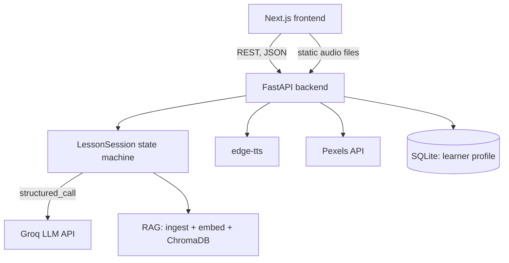
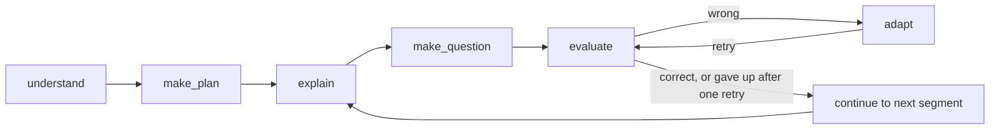

# Architecture

## High-level shape

The backend holds all lesson state **in memory**, keyed by a generated `lesson_id` (`backend/app/api/store.py`). There's no session cookie or auth — a lesson is addressed purely by its ID, and a learner is addressed by the (unvalidated) name they typed on the landing page. This is a deliberate hackathon-scope simplification; see the README's Known Limitations.

## The teaching loop

The core of the app is `LessonSession` in `backend/app/core/state_machine.py` — a single class, one instance per lesson, with one method per step of the loop:

- **understand** — if a document was uploaded, parse + chunk + embed + index it (RAG). If not, the rest of the loop proceeds ungrounded, teaching from the model's own knowledge.
- **make_plan** — one structured LLM call produces 3–5 ordered segments (title + objective each). If the learner has prior session history, a summary of their past weak areas/misconceptions is injected into this prompt — this is what makes personalization actually change the plan, not just get logged.
- **explain** — one structured call per segment: explanation text, key points, the analogy used, and a decision on which subject-aware visual (if any) fits. If the model picks a Mermaid diagram, the generated syntax is validated server-side (`backend/app/visuals/diagram_spec.py`) and retried once if invalid, falling back to no-visual rather than shipping broken syntax to the browser. If it picks a photo, only a search phrase is trusted from the model — the actual image URL is resolved separately against the real Pexels API and the model's own guess at that field is discarded.
- **make_question** — one comprehension-check item, with wrong MCQ options tied to *named* plausible misconceptions, not random distractors.
- **evaluate** — grades the learner's answer. If wrong, it must name the *specific* misconception (reusing one of the question's pre-labeled options if it matches). Also generates a short personalized reaction line (using the learner's name) and a gesture hint for the frontend avatar.
- **adapt** — re-teaches the same segment with an explicitly different analogy than the original, targeted at the diagnosed misconception.
- One retry is allowed per segment (evaluate → adapt → evaluate again), then the loop moves on regardless, recording whether it was ultimately resolved.

All structured outputs are pydantic models (`backend/app/schemas/`), forced via Groq's strict `json_schema` response mode (`backend/app/core/llm.py`). Pydantic's default schema output isn't quite what strict mode requires — every field has to be listed in `required` (optional fields become nullable-but-present instead of absent) and every object needs `additionalProperties: false` — so `llm.py` rewrites the schema recursively before sending it.

## RAG pipeline

`backend/app/rag/`: `ingest.py` (PDF/DOCX/PPTX → chunked text), `embeddings.py` (local `sentence-transformers`, no external call, no rate limit risk during a demo), `vector_store.py` (ChromaDB, persisted to `backend/data/chroma_db`), `retriever.py` (ties the two together). Retrieval is queried fresh per segment (using that segment's title + objective) rather than once for the whole lesson, so grounding stays relevant as the lesson moves between topics within the document.

## API layer

`backend/app/api/lessons.py` exposes the state machine over REST: `POST /api/lessons` (create), `POST /api/lessons/{id}/explain|question|evaluate|adapt|continue`, `GET /api/lessons/{id}/report`. The quiz endpoint strips correct-answer/misconception-label fields before returning to the client — the browser never sees the answer key. Session bookkeeping that the state machine itself doesn't track (which segment we're on, whether we're mid-retry) lives in `LessonState`/`PendingRecord` in `store.py`, layered on top of `LessonSession` rather than baked into it.

## Reliability details worth knowing about

- **LLM calls retry with backoff** on Groq's transient 429/5xx errors, and specifically retry once on a strict-schema validation failure (observed live: the model occasionally hoists a nested field like `visual_type` to the top level; a fresh sample usually fixes it).
- **A 429 whose real wait (from Groq's own rate-limit headers) is long** — i.e. the daily quota, not a transient limit — fails fast with a clear message instead of retrying blindly for ~2 minutes. `backend/app/main.py` has exception handlers so this detail actually reaches the frontend; FastAPI's default behavior on an unhandled exception is a bare "Internal Server Error" with zero detail, which was confirmed the hard way during development.

## Frontend

Next.js App Router, four routes: `/` (landing), `/lesson/[id]` (the segmented player — the state machine that drives explain → quiz → evaluate → adapt → continue client-side, mirroring the backend's loop), `/report/[id]`, `/profile/[learnerId]`. `components/VisualStage.tsx` renders whichever visual spec came back (KaTeX/Mermaid/Recharts/syntax-highlighter/photo/timeline). `components/AvatarPlayer.tsx` holds the illustrated SVG character — no video generation; see the README for why — with independent animation loops for blinking, eyebrows, a multi-frame talking mouth, and arm/hand gestures that both auto-cycle while speaking and hold a fixed pose for quiz-answer reactions.

## Learner profile

`backend/app/profile/`: SQLite via SQLAlchemy, two tables (`Learner`, `LessonHistory`). A learner's ID is just their typed name, lowercased and slugified — no signup, no password, re-entering the same name resumes the same profile. `store.summarize_history_for_prompt()` is the function that turns stored history into the text block injected into `make_plan`'s prompt described above.
